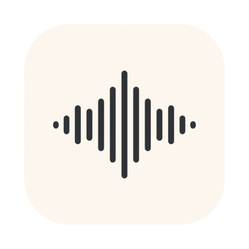
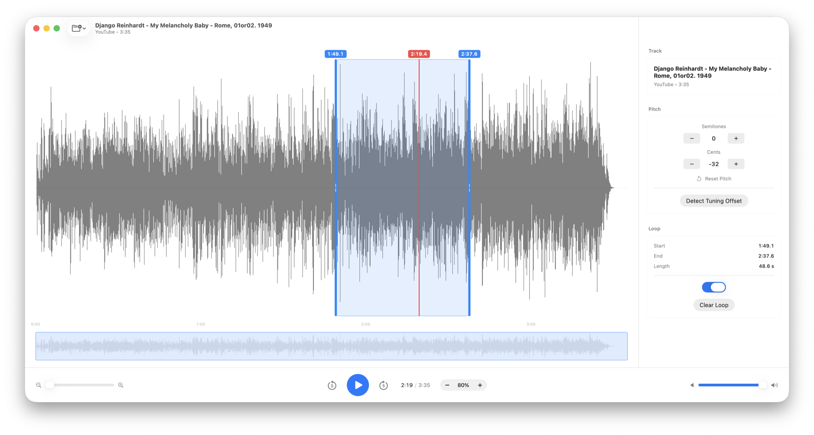

  

<h1 align="center">Shed</h1>

  A local-only macOS app for musicians — slow audio down without changing pitch,
  shift pitch, and loop short phrases while you transcribe.

  <a href="https://willdickerson.github.io/shed/"><b>Website &amp; download →</b></a>
  &nbsp;·&nbsp;
  <a href="https://github.com/willdickerson/shed/releases">Releases</a>

  

## Highlights

- Open local audio/video files, or import from a YouTube URL
- Slow down 30–100% with pitch preserved; shift pitch by semitones and cents
- One-tap tuning-offset detection
- Drag a region on the waveform and it loops seamlessly while you work it out

Everything runs on your Mac — no account, no servers. yt-dlp and ffmpeg ship
inside the app.

Requires macOS 14 (Sonoma) or later · Apple Silicon &amp; Intel.

Install steps: [BETA.md](BETA.md) · Building &amp; releasing: [PACKAGING.md](PACKAGING.md)
